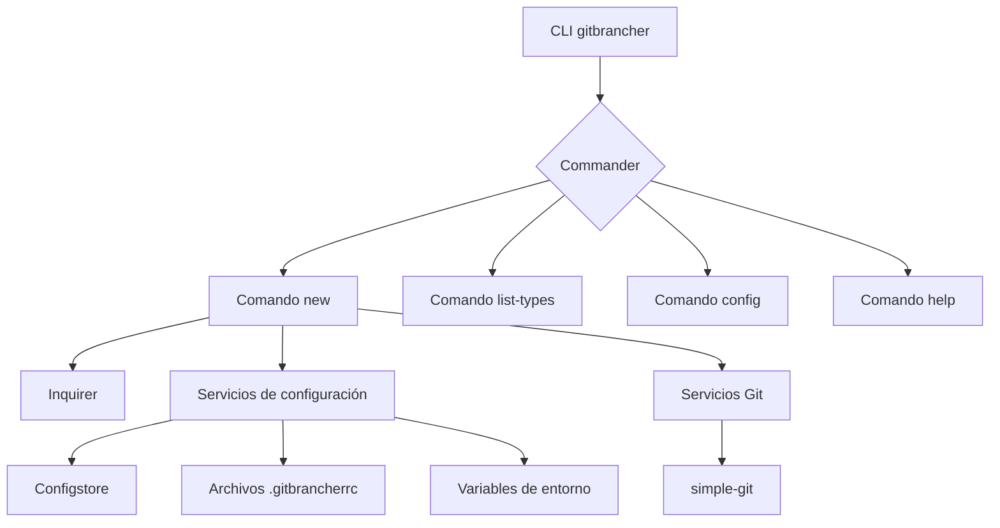

# Arquitectura técnica de GitBrancher

## Componentes principales

### CLI (bin/gitbrancher.js)
- Orquesta los comandos disponibles usando `Commander`.
- Muestra el banner principal con `figlet` y `boxen`.
- Expone comandos `new`, `list-types`, `config` y `help`.

### Comando `new`
- Solicita el tipo de rama y un descriptor mediante `Inquirer`.
- Normaliza los datos para crear el nombre de la rama conforme al estándar `<alias>/<tipo>/<descriptor>`.
- Invoca a `simple-git` para crear la rama y hacer checkout.
- Notifica al usuario del resultado con mensajes estilizados por `chalk`.

### Manejo de configuración (`src/config/userConfig.js`)
- Resolución del alias del usuario siguiendo el orden: variable de entorno, archivo local, archivo global, Configstore, `git config`.
- Persistencia de alias con Configstore.
- Facilita la futura integración con otras fuentes de configuración (p. ej., Azure DevOps).

### Utilidades (`src/cli/utils`)
- `branchName.js`: arma el nombre de la rama y aplica validaciones.
- `textHelpers.js`: sanitiza y convierte textos en slug.

### Servicios Git (`src/git/gitService.js`)
- Encapsula la interacción con `simple-git`.
- Obtiene el usuario de Git y crea ramas de forma segura.

## Flujo de ejecución del comando `new`
1. El usuario ejecuta `gitbrancher new`.
2. Se muestra el banner (salvo modo `--silent`).
3. Se resuelve el alias del usuario.
4. Se listan las categorías de ramas y el usuario selecciona una.
5. Se solicita un descriptor y se valida.
6. Se construye el nombre completo de la rama.
7. Se crea la rama mediante `simple-git` y se realiza el checkout.
8. Se confirma el éxito y se muestra el nombre generado.

## Futuras integraciones
- **Azure DevOps**: autenticación vía token personal, listado de tickets y creación directa desde backlog.

## Consideraciones de diseño
- Código modular para permitir pruebas unitarias e integración futura.
- Tratamiento cuidadoso de errores y mensajes claros al usuario.
- Dependencias sin binarios nativos para asegurar compatibilidad multiplataforma.
